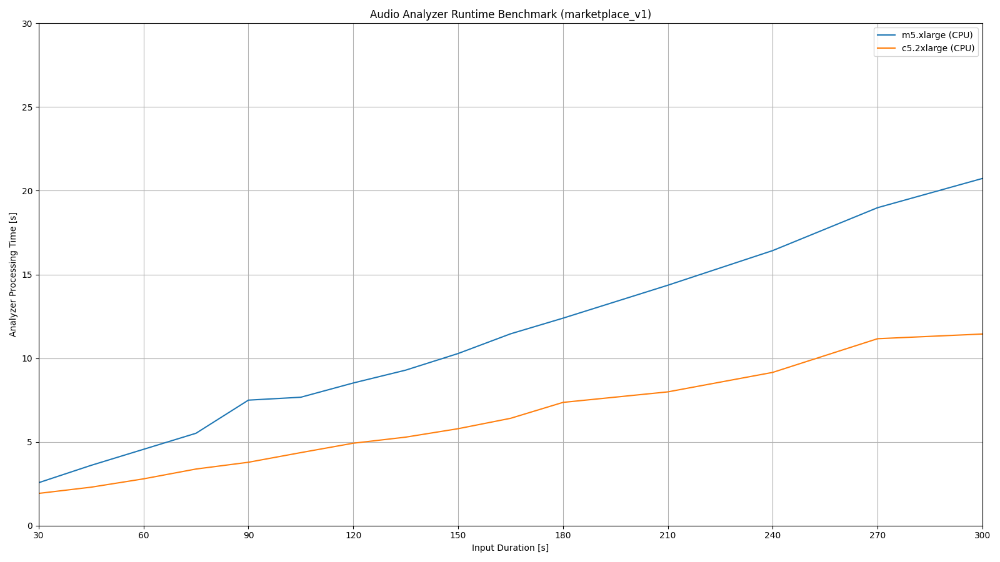

## Cyanite Audio Analyzer

#### Contents:
1. [Overview](#overview)
2. [Quickstart Guide](#quickstart)
3. [Usage](#usage)
4. [Output Specification](#outputspec)
5. [Runtime Benchmarks](#runtime)

___

### Overview:

The Cyanite Audio Analyzer extracts a variety of music-related features out of audio files using machine learning models.

An overview and explanation over the available features can be found in the [feature documentation](feature-documentation.md).

The Audio Analyzer is optimized for CPU usage.

___

### Quickstart Guide: If you want to start right away, please follow these steps:

1. Subscribe to the Audio Analyzer marketplace algorithm
2. Install and launch [JupyterLab](https://jupyterlab.readthedocs.io/en/stable/getting_started/installation.html) (or comparable) on your system
3. Clone this repository and open the [example notebook](examples/cyanite-analyzer-marketplace-example.ipynb)
4. Follow the notebook instructions

___

### Usage:

AWS Marketplace containers can be deployed in three ways:

| Server Mode | Payload Limit | Timeout After |
| :------------- | :------------- | :------------- |
| Real-time Inference | 6 MB | 60 seconds |
| Asynchronous Inference | 500 MB | 15 minutes |
| Batch Transformation | 100 MB | 60 minutes |

__Important__:
- For real-time inference, the maximum payload size of _6MB_ is eqivalent to a 2.5min 320kbit/s MP3 or 6min 128kbit/s MP3
- For real-time inference, the 60s timeout may exceed needed processing time for longer audios
- to circumvent timeout limitations, we recommend deploying in asynchronous inference mode

For more information on deployment, please refer to the [SageMaker Documentation](https://docs.aws.amazon.com/sagemaker/latest/dg/deploy-model.html).

The Audio Analyzer supports a variety of file formats: `mp3`, `wav`, `m4a`, `mp4` and `mpga`. Audio can either be mono or stereo and should have at least a bitrate of 128kbit/s for MP3 files or comparable for other formats. Audio files should not exceed a length of 15 minutes. For longer tracks, the analysis will be rejected.  

Calling the server is done via REST. We recommend using the [SageMaker Python SDK](https://sagemaker.readthedocs.io) for handling invocations.
Audio data is expected to be send as binary data within the data field of a POST request. The accepted content type is `audio/mpeg`.

Examples for setting up and calling endpoints using the SageMaker Python SDK can be found in the [examples](examples) section.
___

### Output Specification:

The container returns json-formatted output.

#### JSON Schemes:

<!--- created with https://github.com/adobe/jsonschema2md --->

| Version | Raw Schema | Documentation | Example Output
| :--- | :--- | :--- | :--- |
| marketplace_v1 | [here](schemes/marketplace_v1/schema/TaggingV8.schema.json) | [here](schemes/marketplace_v1/documentation/TaggingV8.md) | [here](schemes/marketplace_v1/example/tagging_v8_example_output.json) |

___

### Runtime Benchmarks:

This section provides runtime benchmarks for all available marketplace versions. Runtime benchmarks will be provided for all available batch inference instance types. Please note that depending on the input, runtime may vary slightly from the benchmark values.

For more information on instance types, please visit [SageMaker pricing](https://aws.amazon.com/sagemaker/pricing/). 

  
marketplace_v1

Table:
    
- Table colums refer to different lenghts of the input audio file.
    
| Instance Type | 30s | 45s | 60s | 75s | 90s | 105s | 120s | 135s | 150s | 165s | 180s | 210s | 240s | 270s | 300s |
| :--- | :--- | :--- | :--- | :--- | :--- | :--- | :--- | :--- | :--- | :--- | :--- | :--- | :--- | :--- | :--- |
| m5.xlarge (CPU) | 2.6s | 3.6s | 4.6s | 5.5s | 7.5s | 7.7s | 8.5s | 9.3s | 10.3s | 11.5s | 12.4s | 14.4s | 16.4s | 19.0s | 20.7s |
| c5.2xlarge (CPU) | 1.9s | 2.3s | 2.8s | 3.4s | 3.8s | 4.4s | 4.9s | 5.3s | 5.8s | 6.4s | 7.4s | 8.0s | 9.2s | 11.1s | 11.4s |

Plot:    

