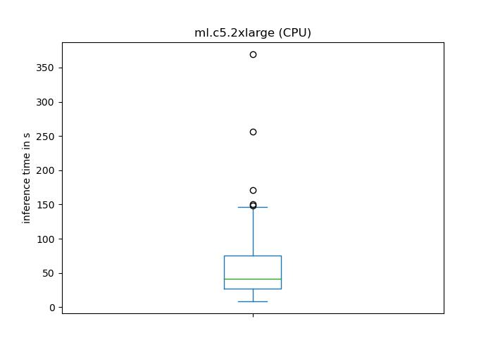
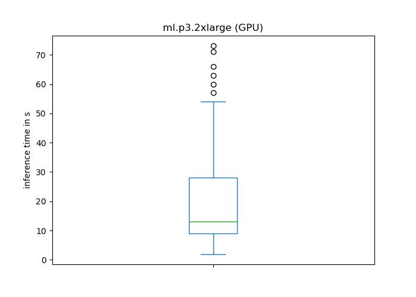

## Cyanite Lyrics Extractor

#### Contents:
1. [Overview](#overview)
2. [Quickstart Guide](#quickstart)
3. [Usage](#usage)
4. [Output Specification](#outputspec)
5. [Runtime Benchmarks](#runtime)

___

### Overview:

The Cyanite Lyrics Extractor extracts the lyrics from a musical audio file using deep learning technology.

The Lyrics Extractor is optimized for CPU and GPU usage and can therefore be run on both. However, we strongly recommend using this service on a GPU powered instance.

___

### Quickstart Guide:

If you want to start right away, please follow these steps:

1. Subscribe to the Lyrics Extractor marketplace algorithm
2. Install and launch [JupyterLab](https://jupyterlab.readthedocs.io/en/stable/getting_started/installation.html) (or comparable) on your system
3. Clone this repository and open the [example notebook](examples/cyanite-lyrics-extractor-marketplace-example.ipynb)
4. Follow the notebook instructions

___

### Usage:

AWS Marketplace containers can be deployed in three ways:

| Server Mode | Payload Limit | Timeout After |
| :------------- | :------------- | :------------- |
| Real-time Inference | 6 MB | 60 seconds |
| Asynchronous Inference | 500 MB | 15 minutes |
| Batch Transformation | 100 MB | Unlimited |

__Important__:
- For real-time inference, the maximum payload size of _6MB_ is eqivalent to a 2.5min 320kbit/s MP3 or 6min 128kbit/s MP3
- For real-time inference, the 60s timeout may exceed needed processing time for longer audios using cpu-bound machines
- to circumvent timeout limitations, we recommend deploying in asynchronous inference mode or using a GPU accelerated machine

For more information on deployment, please refer to the [SageMaker Documentation](https://docs.aws.amazon.com/sagemaker/latest/dg/deploy-model.html).

The Lyrics Extractor supports a variety of file formats: `mp3`, `wav`, `m4a`, `mp4` and `mpga`. Audio can either be mono or stereo and should have at least a bitrate of 128kbit/s for MP3 files or comparable for other formats. Audio files should not exceed a length of 15 minutes. For longer tracks, the analysis will be done on the first 15 minutes of the audio signal.  

Calling the server is done via REST. We recommend using the [SageMaker Python SDK](https://sagemaker.readthedocs.io) for handling invocations.
Audio data is expected to be send as binary data within the data field of a POST request.  

Examples for setting up and calling endpoints using the SageMaker Python SDK can be found in the [examples](examples) section.
___

### Output Specification:

The container returns json-formatted output.

#### JSON Schemes:

<!--- created with https://github.com/adobe/jsonschema2md --->

| Version | Raw Schema |  Example Output
| :--- | :--- | :--- |
| marketplace_v1 | [here](schemes/marketplace_v1/schema/marketplace_v1.schema.json) | [here](schemes/marketplace_v1/example/marketplace_v1_example_output.json) |

___

### Runtime Benchmarks:

This section provides runtime benchmarks for all available lyrics extractor versions. Runtime benchmarks will be provided for all available batch inference instance types. Please note that depending on the input, runtime may vary strongly from the benchmark values. 

For our inference benchmark, we used 99 full duration (3-10 min) commercial music pieces.

For more information on instance types, please visit [SageMaker pricing](https://aws.amazon.com/sagemaker/pricing/). 

|    Measure    | Time in s (GPU)  | Time in s (CPU)|
| :---          | :---             | :--- |
| count         |   99.000000      | 99.000000|
| mean          |   20.090909      |60.777778|
| std           |   16.039550      |54.124301|
| min           |    2.000000      |9.000000|
| 25%           |   9.000000      |27.500000|
| 50%           |   13.000000      |41.000000|
| 75%           |   28.500000      |75.000000|
| max           |  73.000000      |369.000000|
      

  
   

